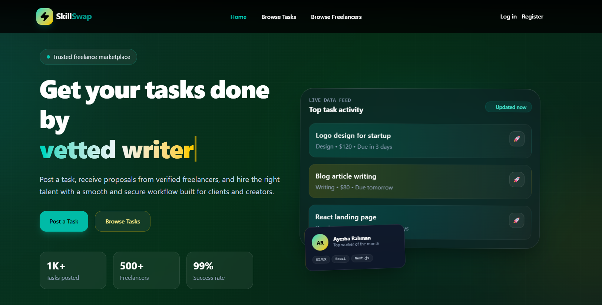
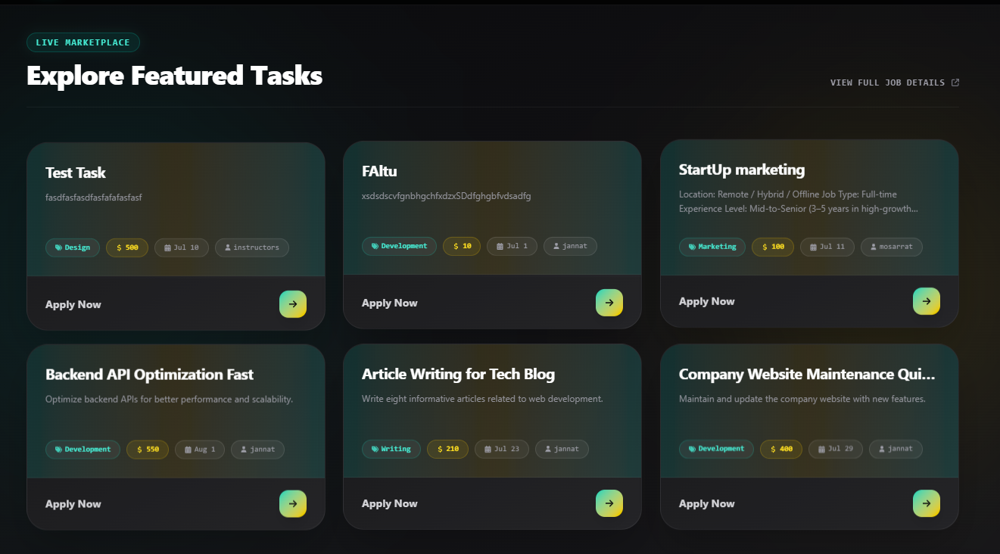
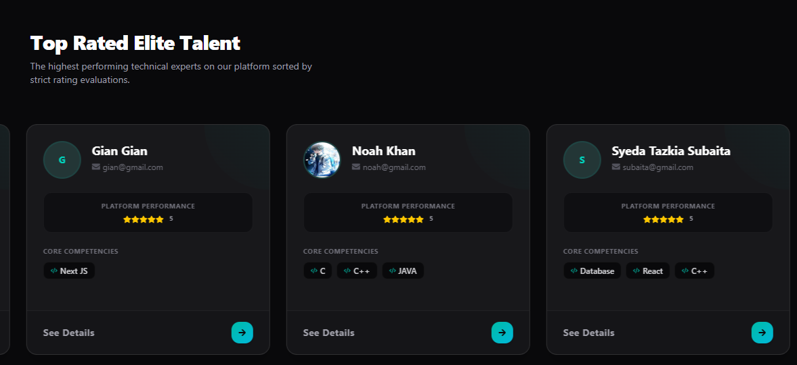
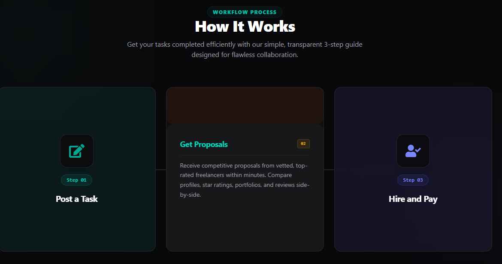
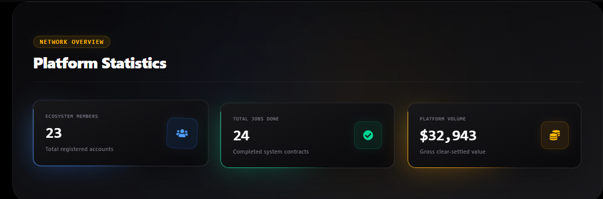
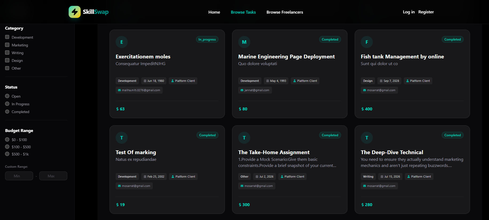
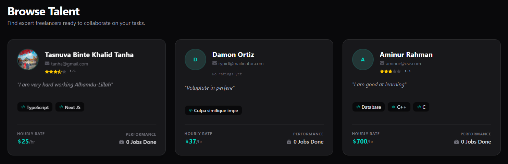

# SkillSwap — Freelance Micro-Task Platform

SkillSwap is a responsive, full-stack freelance marketplace where clients can post small, bite-sized contracts (e.g., logo design, copy editing, or quick bug fixes) and freelancers can submit proposals to get hired. Built as a high-performance modern alternative to platforms like Fiverr or Freelancer.com, it streamlines secure workflows from posting to payment.

---

## 🔗 Live Links

- 🌐 **Live Platform**: [SkillSwap Live](https://skillswap-client-three.vercel.app/)
- 💻 **Frontend Repository**: [GitHub Client](https://github.com/Maliha-Akter/skillswap-client)
- ⚙️ **Backend Repository**: [GitHub Server](https://github.com/Maliha-Akter/skillswap-server)

---
## 📸 Project Screenshots

### 1. Homepage
<p align="center">
  
</p>

### 2. Pinned Task
<p align="center">
  
</p>

### 3. Pinned Freelancer
<p align="center">
  
</p>

### 4. How It Works
<p align="center">
  
</p>

### 5. Platform Statistics
<p align="center">
  
</p>

### 6. Search Tasks Page
<p align="center">
  
</p>

### 7. Browse Freelancers Page
<p align="center">
  
</p>
---

## 🛠️ Technologies Used

### Frontend
- **Next.js** (v14/15) — Framework for React Server Components & optimized page routing.
- **React.js** — Core application library UI layer.
- **Tailwind CSS** — Utility-first responsive styling framework.
- **HeroUI** (@heroui/react) — Premium visual design library with glassmorphic elements.
- **Framer Motion** — Core animation engine for fluid UI/UX state transitions.

### Backend & Database
- **Node.js** — JavaScript runtime environment.
- **Express.js** — Minimalist backend framework managing API routing.
- **MongoDB** — NoSQL cloud database platform.
- **Mongoose** — Object Data Modeling (ODM) layer for database interactions.

### Authentication & Security
- **BetterAuth & Google OAuth** — Federated secure credential management.
- **Asymmetric JWT (jose)** — Verification gateway via remote JWKS endpoint distribution sets.

### Payment System
- **Stripe** — Secure credit card transaction pipeline and billing histories.

### Deployment
- **Vercel** — Production environment for the frontend.
- **Render** — Cloud hosting infrastructure for the backend server.

---

## 🚀 Key Features

### 👤 Role-Based Portals & Core Dashboards
- **Client Route (`/dashboard/client`)**: Form layout engine to post new projects, review incoming freelancer proposals, reject unwanted bids, or accept proposals via checkout.
- **Freelancer Route (`/dashboard/freelancer`)**: Portal to track submitted proposals, manage active project deliverables via interactive modals, edit profiles, and view breakdown metrics of lifetime earnings.
- **Admin Control System (`/dashboard/admin`)**: Hardcoded master system to monitor all platform accounts, toggle account block statuses dynamically, track live task safety constraints, and review absolute Stripe payment history tracking lists.

### 🛡️ Enterprise Security & Validation Architecture
- **OAuth Framework Integration**: Credential email-and-password sign-up maps alongside Google OAuth integration setups smoothly.
- **Asymmetric JWT Verification**: Secure authentication gateway utilizing a remote JWKS dataset endpoint to block malicious network traffic vectors on private backend endpoints.
- **Persistent Middleware Protection**: Advanced route matching patterns under `/dashboard/*` to automatically isolate unauthenticated or unauthorized accounts.

### 🔍 Advanced UX Engineering
- **Server-Driven Query Offsets**: Real-time server-side pagination limiting defaults to 9 items per query execution limit with complete URL state tracking symmetry (`?page=1`).
- **Compound State Matrix Filter**: Blended text debouncing title exploration that operates simultaneously with category criteria selection checkboxes and minimum/maximum budget restrictions.
- **Adaptive Visual Architecture**: Premium custom dark mode layout designed with deep zinc components, clean typography gradients, and responsive navigation layouts for any screen size.

---

## 📦 Dependencies

### Client
- `next`
- `react`
- `react-dom`
- `tailwindcss`
- `@heroui/react`
- `framer-motion`
- `lucide-react`
- `react-icons`
- `clsx`
- `tailwind-merge`

### Server
- `express`
- `mongoose`
- `mongodb`
- `jose`
- `cors`
- `dotenv`

---

## ⚙️ Run Locally

Follow these step-by-step instructions to get a local copy of SkillSwap up and running.

### Clone the Repositories
```bash
# Clone frontend client
git clone https://github.com/Maliha-Akter/skillswap-server.git

# Clone backend server
git clone https://github.com/Maliha-Akter/skillswap-server.git